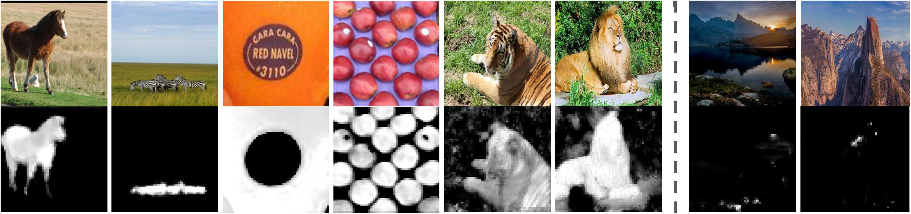
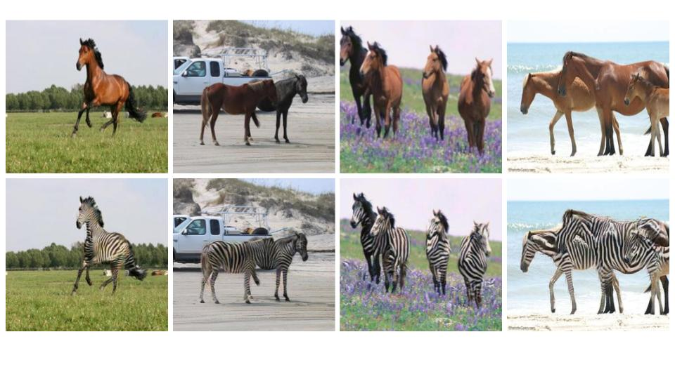
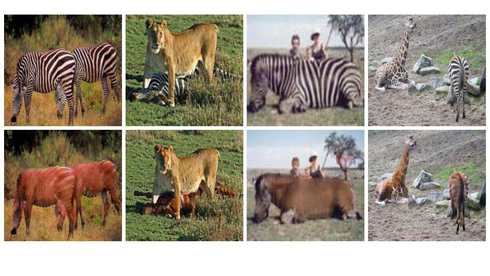
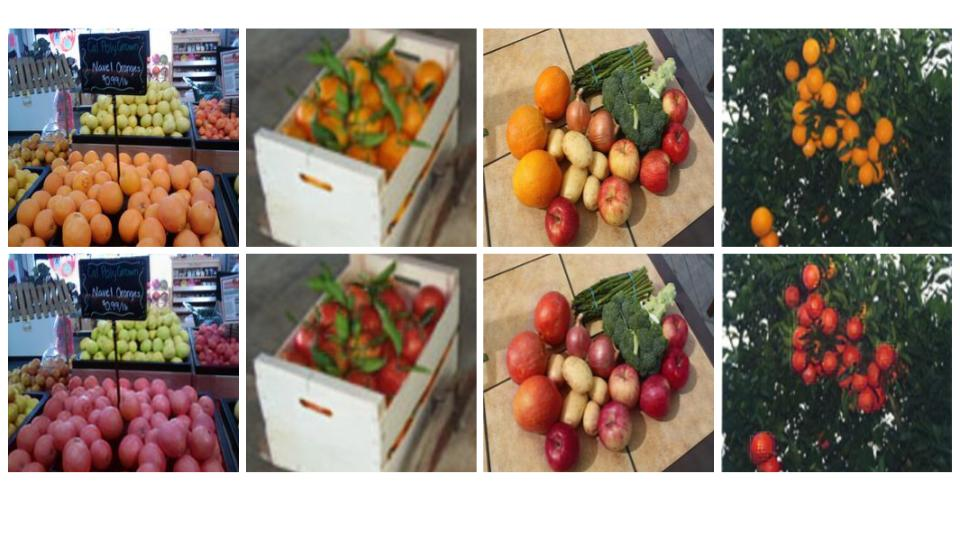

# Unsupervised Attention-guided Image-to-Image Translation

This repository contains the TensorFlow code for our NeurIPS 2018 paper [“Unsupervised Attention-guided Image-to-Image Translation”](https://arxiv.org/pdf/1806.02311.pdf). This code is based on the TensorFlow implementation of CycleGAN provided by [Harry Yang](https://github.com/leehomyc/cyclegan-1). You may need to train several times as the quality of the results are sensitive to the initialization.

By leveraging attention, our architecture (shown in the figure bellow) only maps relevant areas of the image, and by doing so, further enhances the quality of image to image translation.

Our model architecture is defined as depicted below, please refer to the paper for more details: 


## Mapping results
### Our learned attention maps

The figure bellow displays automatically learned attention maps on various translation datasets:  


### Horse-to-Zebra image translation results: 
#### Horse-to-Zebra:
Top row in the figure below are input images and bottom row are the mappings produced by our algorithm.

#### Zebra-to-Horse:
Top row in the figure below are input images and bottom row are the mappings produced by our algorithm.


### Apple-to-Orange image translation results: 
#### Apple-to-Orange:
Top row in the figure below are input images and bottom row are the mappings produced by our algorithm.

#### Orange-to-Apple:
Top row in the figure below are input images and bottom row are the mappings produced by our algorithm.


### Getting Started with the code
### Prepare dataset
* You can either download one of the defaults CycleGAN datasets or use your own dataset. 
	* Download a CycleGAN dataset (e.g. horse2zebra, apple2orange):
		```bash
		bash ./download_datasets.sh horse2zebra
		```
	* Use your own dataset: put images from each domain at folder_a and folder_b respectively. 

* Create the csv file as input to the data loader. 
	* Edit the [```cyclegan_datasets.py```](cyclegan_datasets.py) file. For example, if you have a horse2zebra_train dataset which contains 1067 horse images and 1334 zebra images (both in JPG format), you can just edit the [```cyclegan_datasets.py```](cyclegan_datasets.py) as following:
		```python
		DATASET_TO_SIZES = {
		  'horse2zebra_train': 1334
		}

		PATH_TO_CSV = {
		  'horse2zebra_train': './AGGAN/input/horse2zebra/horse2zebra_train.csv'
		}

		DATASET_TO_IMAGETYPE = {
		  'horse2zebra_train': '.jpg'
		}
		``` 
	* Run create_cyclegan_dataset.py:
		```bash
		python -m create_cyclegan_dataset --image_path_a='./input/horse2zebra/trainB' --image_path_b='./input/horse2zebra/trainA'  --dataset_name="horse2zebra_train" --do_shuffle=0
		```
### Training
* Create the configuration file. The configuration file contains basic information for training/testing. An example of the configuration file could be found at [```configs/exp_01.json```](configs/exp_01.json).

* Start training:
	```bash
	python main.py  --to_train=1 --log_dir=./output/AGGAN/exp_01 --config_filename=./configs/exp_01.json
	```
* Check the intermediate results:
	* Tensorboard
		```bash
		tensorboard --port=6006 --logdir=./output/AGGAN/exp_01/#timestamp# 
		```
	* Check the html visualization at ./output/AGGAN/exp_01/#timestamp#/epoch_#id#.html.  

### Restoring from the previous checkpoint
```bash
python main.py --to_train=2 --log_dir=./output/AGGAN/exp_01 --config_filename=./configs/exp_01.json --checkpoint_dir=./output/AGGAN/exp_01/#timestamp#
```

### Testing
* Create the testing dataset:
	* Edit the cyclegan_datasets.py file the same way as training.
	* Create the csv file as the input to the data loader:
		```bash
		python -m create_cyclegan_dataset --image_path_a='./input/horse2zebra/testB' --image_path_b='./input/horse2zebra/testA' --dataset_name="horse2zebra_test" --do_shuffle=0
		```
* Run testing:
	```bash
	python main.py --to_train=0 --log_dir=./output/AGGAN/exp_01 --config_filename=./configs/exp_01_test.json --checkpoint_dir=./output/AGGAN/exp_01/#old_timestamp# 
	```
* Trained models:
Our trained models can be downloaded from https://drive.google.com/open?id=1YEQMJK41KQj_-HfKFneSI12nWpTajgzT
